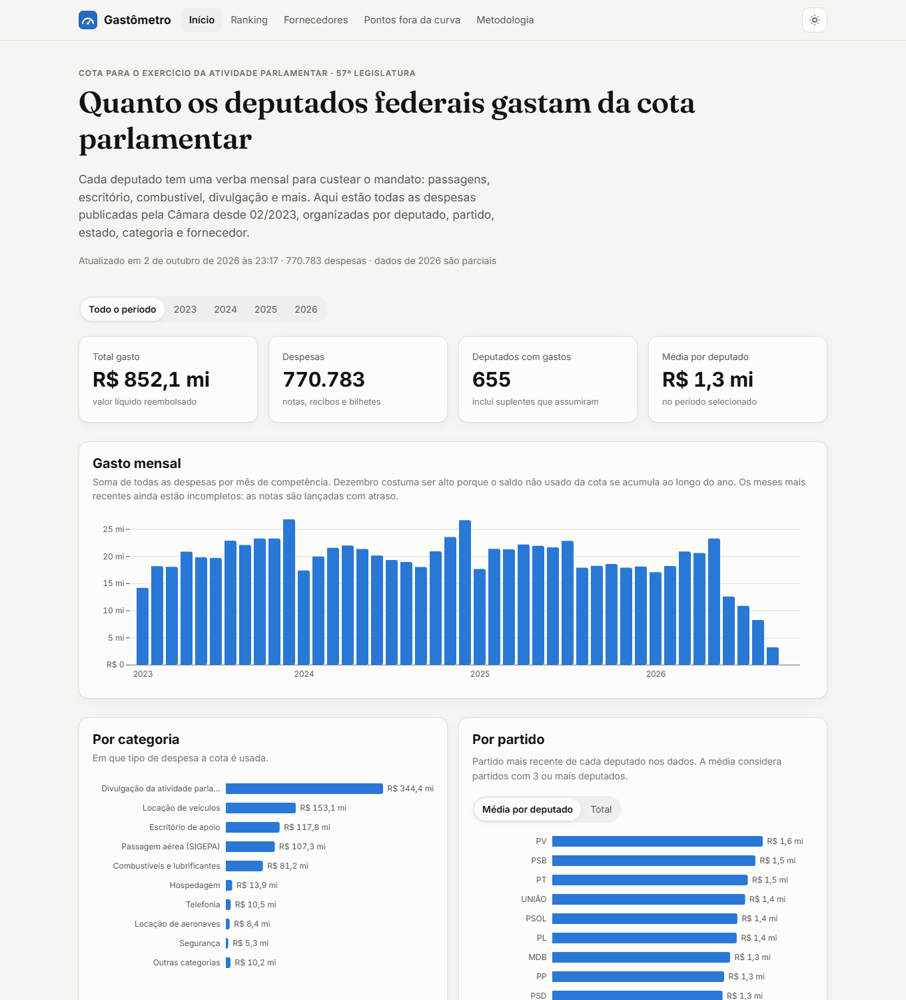
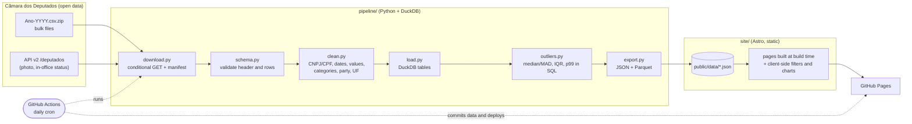

# Gastômetro

[](https://github.com/CoderlunEureon/gastometro/actions/workflows/ci.yml)

**An open data pipeline and public dashboard for Brazilian federal deputies' parliamentary quota spending (CEAP).**

Every member of Brazil's Chamber of Deputies gets a monthly allowance, the *Cota para o Exercício da Atividade Parlamentar* (CEAP), to pay for flights, office rent, fuel, communications and other mandate expenses. The Chamber publishes every reimbursed receipt as open data, but the raw files are large semicolon-separated CSVs that are hard to read. Gastômetro downloads them every day, validates and cleans them, loads them into DuckDB and publishes compact aggregates to a fast static site in Brazilian Portuguese.

**Live demo:** [coderluneureon.github.io/gastometro](https://coderluneureon.github.io/gastometro/)



## What you can do on the site

| Page | What it shows |
| --- | --- |
| **Início** | Headline numbers, monthly spend, spend by category, party (total or per deputy) and state, top spenders; all filterable by year |
| **Ranking** | Every deputy ranked by spend, filterable by year, state, party, category, name and "currently in office" (filters live in the URL, so views can be shared) |
| **Deputado** (one page per deputy) | Photo, party and state, timeline, category breakdown, year-by-year estimated quota use against the state median, top suppliers, largest receipts with links to the original documents, and that deputy's statistical outliers |
| **Fornecedores** | Search suppliers by name or CNPJ and see which offices paid them the most |
| **Pontos fora da curva** | Statistically atypical expenses, months and suppliers, each with its method and a prominent disclaimer |
| **Metodologia** | Source files, row counts, cleaning rules, limitations, outlier methods and state quota values |

Light and dark themes, responsive down to phone width, charts with hover tooltips (Observable Plot).

## Real numbers (pipeline run of 2 Oct 2026)

| | |
| --- | --- |
| Source files | `Ano-2023` … `Ano-2026.csv.zip` (26 MB zipped, ~280 MB of CSV) |
| Rows read | **787,333** |
| Rows loaded (57th legislature) | **773,984** (13,349 rows from Jan 2023 belong to the previous legislature; 0 rejected by validation) |
| Deputy expenses | **770,783** receipts, **R$ 852.1 million**, **655** deputies (incl. substitutes), **45,494** suppliers |
| Party leadership expenses (kept out of rankings) | 3,201 receipts, R$ 3.8 million |
| Period | Feb 2023 – Oct 2026 (2026 is partial) |
| Statistical outliers | 9,060 expenses (of 738,965 evaluable), 308 deputy-months, 385 suppliers |
| Output for the site | **8.6 MB** (655 per-deputy JSON files, ~12 KB each, plus 5 aggregate files and a Parquet file) |
| Runtime | ~35 s on a laptop (after download) |
| Tests | 50 pytest tests, all offline |

## Architecture



## Pipeline steps

1. **Download** (`download.py`): fetches `https://www.camara.leg.br/cotas/Ano-{YYYY}.csv.zip` for every year since 2023 with `If-Modified-Since`, records `Last-Modified`/ETag in `data/raw/manifest.json` and retries on failure. It also fetches the 57th legislature's deputies from the API for photos and current status. That step is optional: if the API is down, the pipeline falls back to the CSV and the conventional photo URL.
2. **Validate** (`schema.py`): the run fails if any required column is missing, warns on unknown new columns, and rejects and counts rows whose net value, month or year cannot be parsed. The files are UTF-8 with a BOM, use `;` as the separator, quote every field and contain multi-line quoted fields.
3. **Clean** (`clean.py`):
   - CNPJ and CPF are reduced to digits, check digits are verified, lost leading zeros are recovered, and placeholders such as `00.000.000/0000-06` (internal Chamber services) are dropped.
   - CPFs of private individuals are masked (`***.982.247-**`) and never appear in the output. The deputy's own CPF column is never read.
   - Values (`1234.56` and `1.234,56`) and dates are parsed.
   - Sub-quota categories get short canonical pt-BR labels.
   - Party acronyms are normalised (`PCdoB`, `UNIÃO`, `S.PART.` → `S/PARTIDO`), and UFs are checked against the 27 states (`NA` is used for leaderships).
4. **Load** (`load.py`): Arrow batches go into DuckDB (`data/gastometro.duckdb`), along with a deputies dimension and the UF quota table.
5. **Analyse** (`outliers.py`): SQL inside DuckDB, so the tests exercise exactly the production code.
6. **Export** (`export.py`) writes these files to `site/public/data/`:
   - `meta.json`: sources, update dates, row counts
   - `overview.json`: by year, month, category, party and UF
   - `ranking.json`: deputy × year × category matrix
   - `deputados/{id}.json`: one file per deputy
   - `fornecedores.json`: the top 4,000 suppliers, with their main paying offices
   - `outliers.json`
   - `gastos_mensais.parquet`: deputy × month × category, for analysts

## Methodology summary

- **Amount** is `vlrLiquido`, the net amount actually reimbursed after deductions. Refunded air tickets appear as negative values and are summed as published.
- **Month** is the competence month published by the Chamber (`numMes`/`numAno`).
- **Scope** is the 57th legislature (Feb 2023 onwards). Party leaderships ("Liderança do X", "LID.GOV-CD") are counted separately, not as deputies.
- **Party** is each deputy's most recent party in the data. Other parties the deputy belonged to are listed on their page.

### "Pontos fora da curva" (statistical outliers)

| Finding | Method |
| --- | --- |
| **Atypical expense** | Compared with expenses of the **same category by deputies from the same state** (which accounts for the per-state quota). Flagged only when the modified z-score `0.6745·(ln x − median)/MAD` is above **3.5** (Iglewicz & Hoaglin) **and** the value is above Tukey's far-out fence `Q3 + 3·IQR`. Groups with fewer than 30 expenses or with zero variation are not evaluated. |
| **Atypical month** | Monthly total ÷ the state's monthly quota, compared with all deputy-months of the same year (modified z > 3.5 and above 100% of the monthly quota). The quota rules allow unused balance to roll over within a year, so such months are allowed by the rules. |
| **Supplier with many offices** | Number of distinct offices paying a supplier, compared with suppliers in the same main category. Flagged when it is above the category's 99th percentile and at least 10. Air tickets, the housing allowance top-up and entries without a CNPJ/CPF are excluded. |

State quota values (Ato da Mesa, Jan 2023, from R$ 36,582.46 in DF to R$ 51,406.33 in RR, plus the 13.75% adjustment for 2026) are used **only** to normalise across states. They live in `pipeline/gastometro/quota.py`; the 2023 values were cross-checked against the per-state table [published by Itatiaia](https://www.itatiaia.com.br/politica/saiba-quanto-cada-deputado-federal-pode-gastar-com-a-cota-parlamentar) (Oct 2025), and the 2026 values are estimated by applying the adjustment.

> **Disclaimer.** The data is official and shown as published by the Câmara dos Deputados. These are real, named people: a statistical outlier only means that a value is far from what is typical for its comparison group. **It does not indicate any irregularity**, and there are many ordinary explanations, such as bundled payments, annual contracts, long trips and the quota balance rolling over. Always read the original receipt, which is linked whenever the Chamber publishes it, before drawing any conclusion. This project is independent and not affiliated with the Chamber of Deputies.

## Running it locally

Requirements: Python ≥ 3.12 (tested on 3.14) and Node ≥ 22.12 (tested on 24).

```bash
# 1. pipeline
python -m venv .venv
.venv/Scripts/activate            # Windows (Git Bash: source .venv/Scripts/activate)
# source .venv/bin/activate       # macOS / Linux
pip install -e "pipeline[dev]"

cd pipeline
pytest -q                                  # offline tests on small fixture CSVs
python -m gastometro run                   # download 2023..current year, build data
python -m gastometro run --years 2024-2025 # specific years
python -m gastometro run --skip-download   # reuse files in data/raw
python -m gastometro run --sample tests/fixtures/ceap_amostra.csv --db ../data/amostra.duckdb --out ../data/amostra   # offline demo

# 2. site
cd ../site
npm ci
npm run dev        # http://localhost:4321
npm run build      # static output in site/dist
```

To build for a GitHub Pages project URL, set `BASE_PATH=/gastometro/` and `SITE_URL=https://coderluneureon.github.io`.

## Automation

| Workflow | What it does |
| --- | --- |
| `.github/workflows/ci.yml` | pytest + site build on every push and PR |
| `.github/workflows/update-data.yml` | Daily cron (06:17 BRT): tests, runs the pipeline, uploads the DuckDB file and a run summary as an artifact, commits `site/public/data` when something other than the timestamp changed, then calls the Pages deploy |
| `.github/workflows/pages.yml` | Builds the Astro site with the right base path and deploys it to GitHub Pages (on pushes touching `site/`, on demand or when called) |

Enable it under **Settings → Pages → Source: GitHub Actions**. The data workflow needs **Settings → Actions → General → Workflow permissions: Read and write**.

## Project layout

```
pipeline/            Python package `gastometro` (download, schema, clean, load, outliers, export, cli)
  tests/             pytest suite + fixtures (synthetic CSVs and their generator)
site/                Astro site (pt-BR), Observable Plot charts
  public/data/       generated aggregates (committed so the site builds without the pipeline)
data/                raw downloads and DuckDB database (git-ignored)
docs/screenshot.png
.github/workflows/   ci, update-data, pages
```

## Data source and licence

- Data: **Câmara dos Deputados, Dados Abertos: Cota para o Exercício da Atividade Parlamentar**
  ([bulk files](https://www2.camara.leg.br/transparencia/cota-para-exercicio-da-atividade-parlamentar/dados-abertos-cota-parlamentar), [API v2](https://dadosabertos.camara.leg.br/swagger/api.html)). Brazilian public open data. Please cite the Câmara dos Deputados as the original source when you reuse it. Deputy photos are served directly from the Chamber's website.
- Code: [MIT](LICENSE) © 2026 Daniel.
